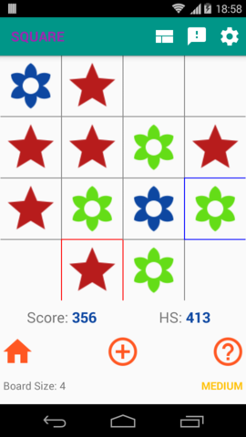
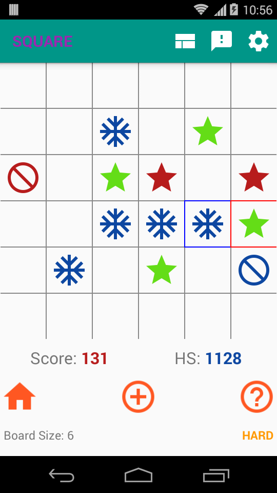
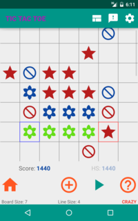

# Square Tic Tac Toe

[Tic Tac Toe](https://en.wikipedia.org/wiki/Tic-tac-toe) (also known as Noughts and crosses or Xs and Os) might be familiar to you. It is typically played on a 3x3 board between two players who take turns to form a **straight line** in any direction.

Now imagine a 4x4 board, with players trying to place four moves in such a manner as to form a **Square** (four equal sides and all four angles at 90 degrees) and voila! you get the idea behind this game

Hmm, fine... but how do you extend the games for larger board size, say 7x7 board? Each player is given fixed number of 'block' moves that varies based on board size - they can be used to prevent a cell being part of straight line or square.

 

### Screen shots

  

 

### Project Status

* The app on Android play store is unlikely to get major updates
* I plan to release parts/whole of AI logic in coming months, most likely rewritten in Python
  * You can check out a generic NxN Tic Tac Toe AI logic, written in `java` [here](./genericTicTacToe)

