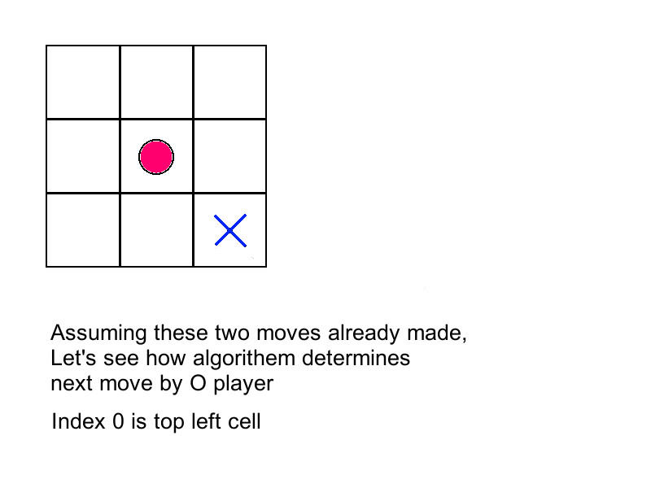

## genericTicTacToe

A possibly (as far as I have tested) unbeatable **NxN Tic Tac Toe** AI logic, where **linesize=N**

* [GenericTicTacToe.java](./GenericTicTacToe.java) - file with AI logic

* [Thanks to this redditor for finding fault with previous version of code](https://www.reddit.com/r/programming/comments/3pxdlw/unbeatable_nxn_generic_tic_tac_toe_ai_logic_n3/cwbcp87)
	* Wrote a [test](./test.java) to confirm 3x3 board is unbeatable for all possible moves with the patch
* **To do:** Test 4x4 and higher board sizes

 
Here's an illustration of how this AI works
 

 
## Deploy

To make a playable version,  cross-platform game development framework [libGDX](https://libgdx.badlogicgames.com/) was used

* [Android apk](https://drive.google.com/file/d/0B0NTnLwARdzoeHVzTjBLSWJNRHc/view?usp=sharing)
* [Java Jar file](https://drive.google.com/file/d/0B0NTnLwARdzoRjhJNmVCbVBLV00/view?usp=sharing)
* Asset Credits
	* [Alphabet X](https://openclipart.org/detail/4871/effect-letters-alphabet-silver)
	* [Alphabet O](https://openclipart.org/detail/80071/effect-letters-alphabet-red)

 
## License

This work is licensed under a [Creative Commons Attribution-NonCommercial-ShareAlike 4.0 International License](http://creativecommons.org/licenses/by-nc-sa/4.0/)
